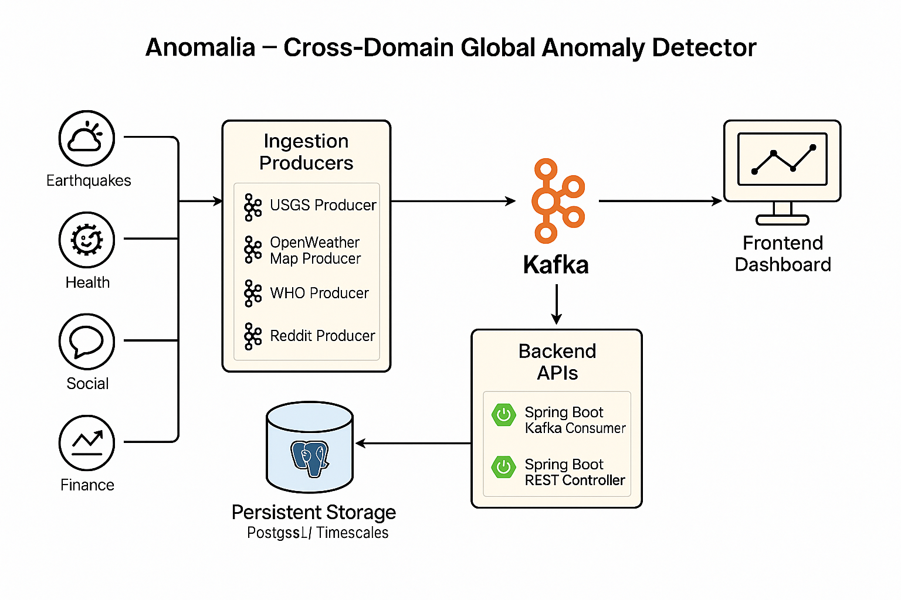

## 🌐 Anomalia – Cross-Domain Global Anomaly Detector

Anomalia is a full-stack, real-time anomaly detection system that ingests and analyzes data across geophysical, environmental, social, epidemiological, and financial domains. Designed for large-scale awareness and research, it leverages modern open-source technologies and global data APIs.

---
### 🚀 Tech Stack

| Layer       | Technology                                          |
|-------------|-----------------------------------------------------|
| Ingestion   | Python + Kafka Producers                            |
| Backend     | Spring Boot (Java 17) + Kafka Consumers + REST APIs |
| Database    | PostgreSQL / TimescaleDB                            |
| Frontend    | ReactJS Dashboard                                   |
| DevOps      | Docker, Kafka UI, GitHub                            |

---

### 📡 Data Sources

- 🌍 **USGS**: Real-time earthquake data  
- 🌤 **OpenWeatherMap**: Climate anomalies 
- 🧬 **WHO**: Public health outbreak alerts  
- 💬 **Reddit API**: Social signal spikes  
- 📉 **Alpha Vantage**: Financial volatility

### 📐 System Architecture

